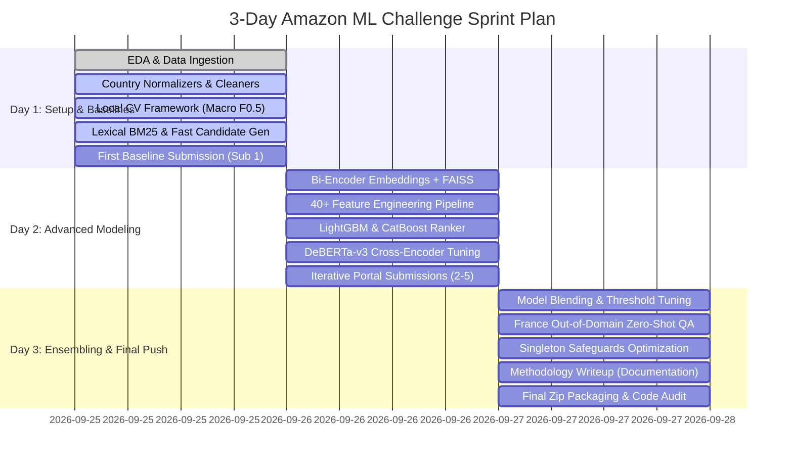

# 🏆 Hackathon Roadmap & Team Execution Plan (Amazon ML Challenge 2026)

**Team Goal:** Win the Amazon ML Challenge 2026 Business Entity Resolution Track by maximizing Macro $F_{0.5}$ score, minimizing blocking candidate size, and executing a zero-data-leakage pipeline.

---

## 📅 3-Day Sprint Timeline

---

## 👥 Task Assignments & Responsibility Matrix

### 👤 Member 1: Lead Architect & Neural Modeling
- **Primary Task:** Transformer Cross-Encoder fine-tuning (`DeBERTa-v3-base` / `DeBERTa-v3-large`).
- **Secondary Task:** Ensemble blending (`LightGBM` + `DeBERTa`), output pipeline, submission uploads.
- **Milestone:** Deliver Cross-Encoder pairwise classifier with AUC > 0.98.

### 👤 Member 2: Data Normalization & Candidate Generation (Blocking)
- **Primary Task:** Advanced preprocessor for multi-country noisy text (`US`, `India`, `France`).
- **Secondary Task:** Hybrid blocking (BM25 + FAISS Dense Vector Indexing).
- **Milestone:** Maximize blocking recall (>98%) while keeping average candidate count $\le 20$ per $S_1$ entity.

### 👤 Member 3: Feature Engineering & GBDT Specialist
- **Primary Task:** Compute 40+ granular similarity features (Levenshtein, Jaro-Winkler, Token Set/Sort, Address house number match, Postal code match).
- **Secondary Task:** Train and tune `LightGBM` and `CatBoost` ranking models with group-wise ranking objectives.
- **Milestone:** Rapid training cycles (< 5 min) for lightning-fast feature iterations.

### 👤 Member 4: Validation Engine, Quality Assurance & Methodology Lead
- **Primary Task:** Build exact local validation CV pipeline computing per-entity Macro $F_{0.5}$.
- **Secondary Task:** Verify format with `utils/validate_submission.py`, manage git sync, write `Documentation_template.md`.
- **Milestone:** Zero invalid submissions, perfect correlation between local CV and portal leaderboard score.

---

## 💡 Creative & Differentiating Strategies ("How We Win")

1. **Precision-Biased Thresholding ($F_{0.5}$ Calibration):**
   - $F_{0.5}$ penalizes false positives twice as heavily as false negatives.
   - Traditional models predict $\ge 0.5$. We calibrate the threshold per country ($T_{\text{US}}, T_{\text{IN}}, T_{\text{FR}} \approx 0.68 - 0.78$) to drastically suppress false merges.

2. **Singleton Safeguard:**
   - Singletons (entities with 0 matches) represent a huge portion of the dataset. Correctly outputting an empty string scores a perfect 1.0; a single false positive drops it to 0.0.
   - We apply a strict singleton classifier / threshold margin to never guess when confidence is low.

3. **Zero-Shot Generalization for France:**
   - The test set includes France (`FR`), which is unseen in training (`US`, `India`).
   - We implement language-agnostic legal suffix normalization (`SAS`, `SARL`, `SA`, `EURL`) and token-level multilingual transformers (`xlm-roberta` / `bge-m3` / `multilingual-e5`).

4. **House / Building Number Constraint & Address Parsing:**
   - Two businesses with identical street names but different building numbers (e.g., "102 Main St" vs "108 Main St") are distinct.
   - We extract numeric building tokens and penalize candidate pairs with conflicting primary address numbers.

5. **Graph Consistency & Transitivity:**
   - If $S_1$ matches $S_2$ and $S_1$ matches $S_3$, the similarity between $S_2$ and $S_3$ must also be high. We run connected-component / clique verification to prune inconsistent links.

---

## 🔄 Daily Submission Strategy (Max 5/day)

- **Day 1:**
  - Sub 1: Cleaned Lexical BM25 baseline (verifies pipeline & scoring).
  - Sub 2: Fast LightGBM model with basic string similarity features.
- **Day 2:**
  - Sub 3: Hybrid Blocker (BM25 + FAISS Embeddings) + Feature-Rich LightGBM.
  - Sub 4: Fine-tuned DeBERTa-v3 Cross-Encoder.
  - Sub 5: GBDT + DeBERTa ensemble.
- **Day 3:**
  - Sub 6: Calibrated threshold model targeting high precision.
  - Sub 7: Graph consistency filtered predictions.
  - Sub 8-10: Final optimal ensemble blends and post-processed final submissions.
